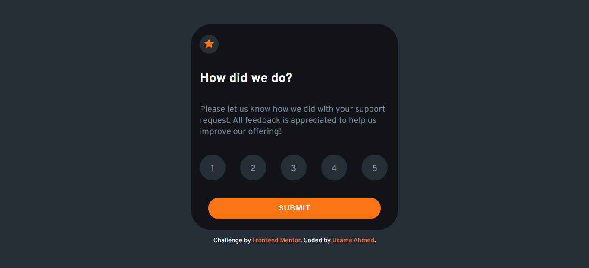

# Frontend Mentor - Interactive rating component solution

This is a solution to the [Interactive rating component challenge on Frontend Mentor](https://www.frontendmentor.io/challenges/interactive-rating-component-koxpeBUmI). Frontend Mentor challenges help you improve your coding skills by building realistic projects. 

## Table of contents

- [Overview](#overview)
  - [Links](#links)
  - [Screenshot](#screenshot)
  - [Built with](#built-with)
  - [Author](#author)

## Overview

 

## Links

- Solution URL: [link](https://github.com/UsamaBinKashif/profile_card-component)
- Live Site URL: [link](https://usamabinkashif.github.io/profile_card-component/)

 

## Screenshots

.png)

 

## Built with
 

 

 

 

## Author

- Website - [Usama Bin Kashif](https://github.com/UsamaBinKashif)
- Frontend Mentor - [@UsamaBinKashif](https://www.frontendmentor.io/profile/UsamaBinKashif)
- Twitter - [@UsamaBinKashif](https://twitter.com/UsamaBinKashif)